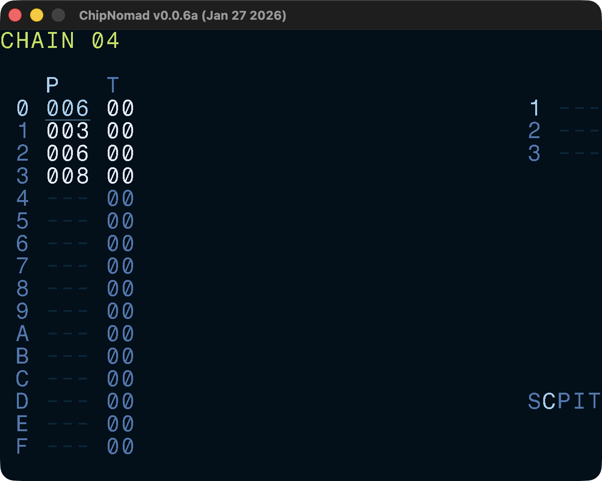

# Chain Screen

A chain is a sequence of phrases. You can have up to 16 phrases in a chain and use the same phrase many times. The second column is the transpose value in semitones.

If the chain is used in the project multiple times, then there will be an asterisk (**\***) character next to its number.

## Controls

In addition to the [common controls](/manual/#common-controls) the following controls are available:

- **OPT** + \[**LEFT** or **RIGHT**\]: navigate between tracks
- **OPT** + \[**UP** or **DOWN**\]: navigate between chains in the current track
- Select range, then **SHIFT** + **EDIT**: clone phrases