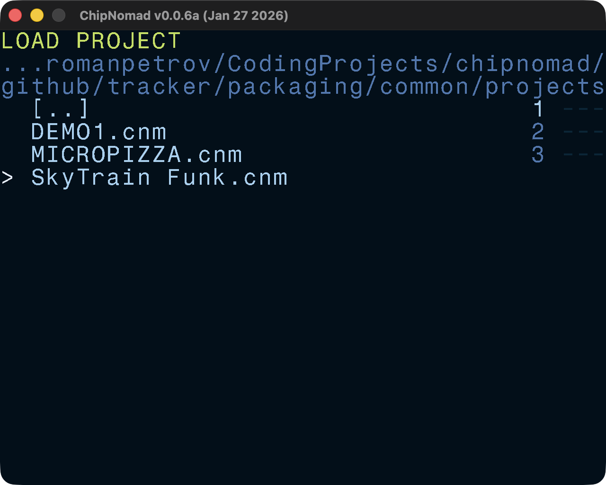
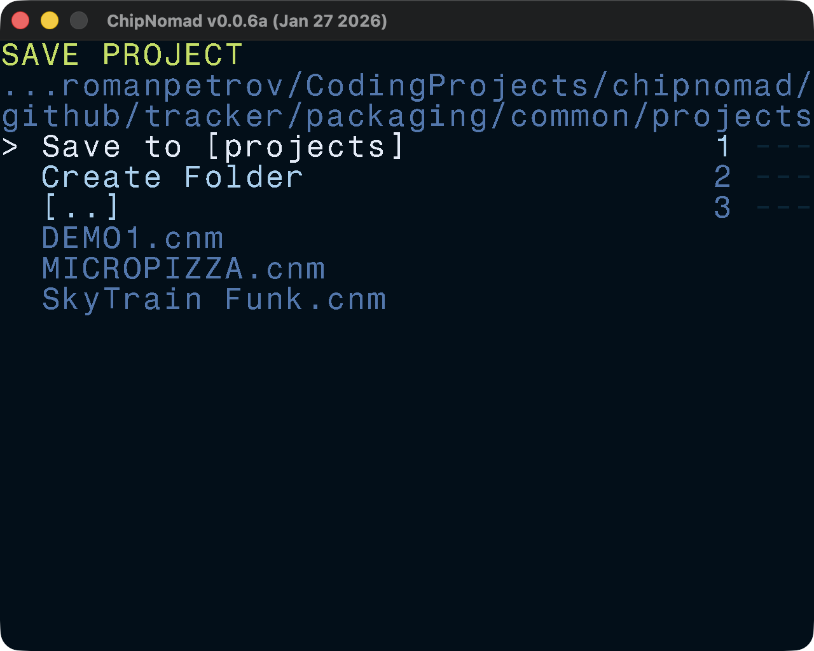

# File Browser

File browser is used to load/save projects, instruments, etc. The UI of this screen is pretty self-explanatory.

## Controls

- **DIRECTION**: navigate the file list
- **EDIT**: select the list item
- **OPT**: exit the screen
