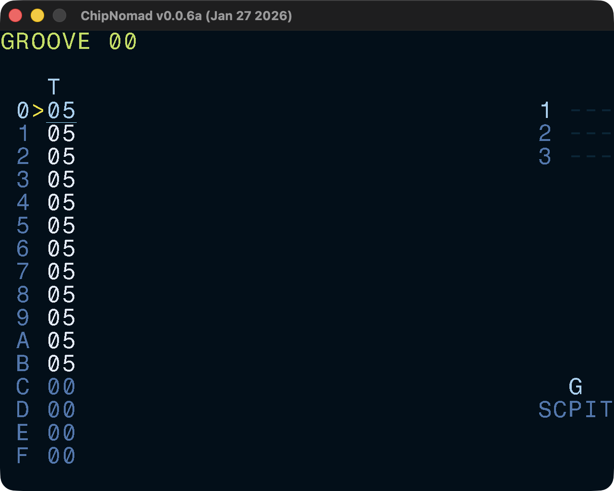

# Groove Screen



As a true chiptune tracker, ChipNomad takes in account certain constraints of real retro platforms and doesn't let you directly control BPM. Instead, it uses tick rate and grooves to control the song tempo and, well, groove.

On the real platforms (e.g. ZX Spectrum) the tick rate is tied to the frame rate (usually, 50 or 60Hz). ChipNomad allows you to define tick rate up to 200Hz at the [Project screen](project-screen).

Groove table values define the duration of a phrase row in ticks.

```
06 06: Standard groove (125BPM at 50HZ tick rate)
07 05: Light shuffle
08 04: Triplet feel shuffle
07 06: Approximation of 6.5 speed
```

Phrase rows for which a groove row value is zero are skipped. It allows creation of shorter phrases. For example, use this groove to have 12 step-long phrases:

```
06 06 06 06 06 06 06 06 06 06 06 06 00 00 00 00
```

Groove playhead is not tied to phrase playhead, and you can create weird uneven grooves.

## How to calculate the BPM from the groove?

Knowing BPM of the song is still important but you will need to do some math to find it.

```
BPM = 60 * TickRate / Ticks4

Ticks4 = duration of 4 phrase rows in ticks
```

Examples:

- 50Hz tick rate, default `06 06` groove. 4 rows are 24 ticks. BPM: `60 * 50 / 24 = 125`
- 60Hz tick rate, `06 04` groove. 4 rows are 20 ticks. BPM: `60 * 60 / 20 = 180`
- 50Hz tick rate, `05 04 03 02` groove. 4 rows are 14 ticks. BPM: `60 * 50 / 14 ≈ 214.3`

## Controls

In addition to the [common controls](/manual#common-controls) the following controls are available:

- **OPT** + **DIRECTION**: navigate between grooves
- **EDIT** + \[**UP**, **DOWN**\]: LSDJ-style paired rows edit for easier swing creation
