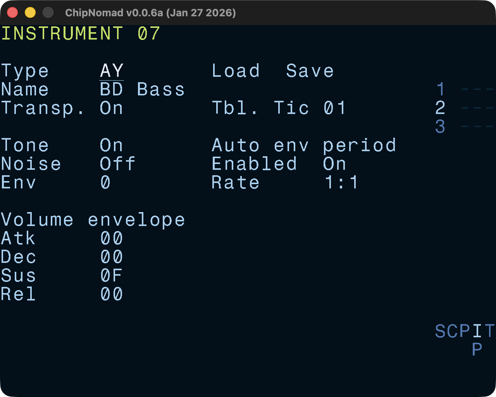
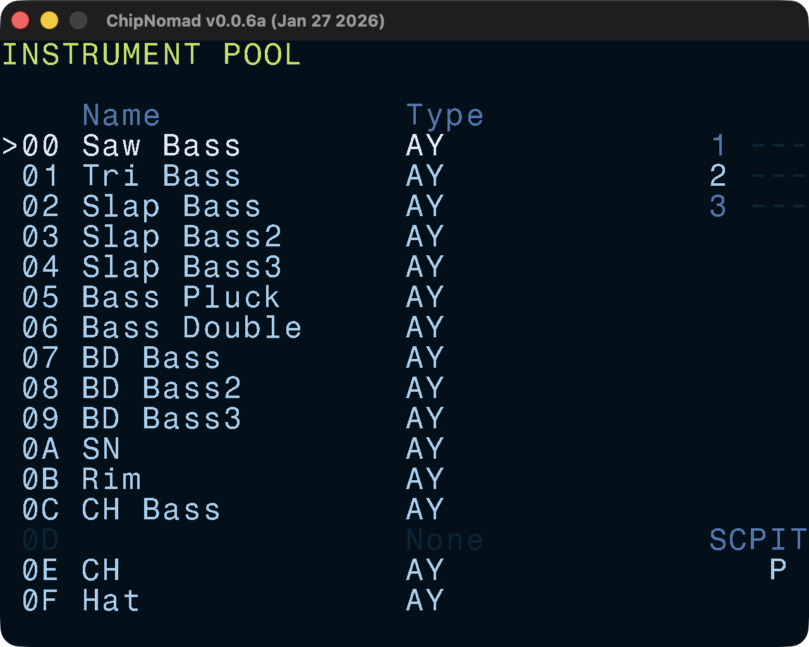

# Instrument Screens



## Instrument Editor

All instruments have a few common parameters:

- Instrument type (currently None or AY)
- Name (up to 15 characters)
- Default table speed (ticks per table row)
- Transpose enable/disable

Each instrument has a corresponding default table which has the same number (00-7F range). While you can use tables in 00-7F range as aux tables, it is not recommended to do so for simplicity. Tables are the main sound design tools in ChipNomad.

### AY Instrument parameters

In addition to common instrument parameters, AY instruments have these parameters:

- Mixer: tone on/off, noise on/off, envelope shape (0-F)
- Volume ADSR envelope (software generated)
- Auto envelope period settings: enabled/disabled, rate (1:1 - 9:9)

AY-3-8910/YM2149F chip can produce only square waves. Tone sound can be mixed with 1-bit noise using logical AND. The chip doesn't hardware ADSR envelopes so they're generated in software. AY has a primitive volume envelope generator which is rarely used for its original purpose. Usually, periodic envelope shapes (8, A, C, E) of the generator are used to create non-square bass sounds. Auto envelope settings control the envelope period.

A couple of things to try:

- Disable both tone and noise, set env shape to 8 (saw). Enable auto envelope and set rate to 2:1. You've got a nice thick bass sound.
- Enable tone, disable noise, set env shape to E. Enable auto envelope and set rate to 2:1. You've got a classic "flowing" AY env bass sound. Experiment with rate values, you can get some interesting sounds.

### Controls

- **OPT** + \[**LEFT** or **RIGHT**\]: navigate between instruments:
- **EDIT** + **PLAY**: preview instrument:
- **SHIFT** + **OPT**: copy instrument
- **SHIFT** + **PLAY**: paste instrument

## Instrument Pool

This is a convenient screen where you can see all project instruments and reorder them. Also, during playback you can see instruments that are currently playing.

### Controls

- **EDIT**: edit instrument (jumps to Instrument screen)
- **SHIFT** + **OPT**: copy instrument
- **SHIFT** + **EDIT**: paste instrument
- Hold **EDIT**, then **UP** / **DOWN**: reorder instruments
