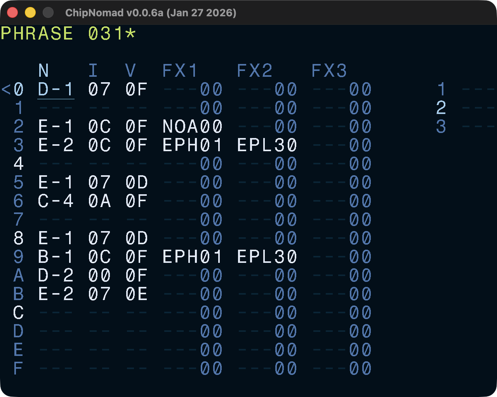

# Phrase Screen

The phrase screen layout should be familiar for everyone who is familiar with trackers. You have your typical columns: note, instrument, volume, FX. Like M8, ChipNomad has 3 FX columns.

Phrases are 16 rows long, unlike patterns in classic trackers. But when you have a chain with multiple phrases, then the Phrase screen works similar to a pattern editor: when you do below row F or above row 0, Phrase screen moves to the next/previous phrase in the chain.

If the phrase is used in the project multiple times, then there will be an asterisk (**\***) character next to its number.

## Controls

In addition to the [common controls](/manual#common-controls) the following controls are available:

- **OPT** + **EDIT** on an empty note: insert note off
- **EDIT** + \[**UP** or **DOWN**\] on an FX name column: open FX select screen
- **OPT** + \[**LEFT** or **RIGHT**\]: navigate between tracks
- **OPT** + \[**UP** or **DOWN**\]: navigate between phrases in the current chain
- Select range in the instrument column, then **SHIFT** + **EDIT**: clone instruments
