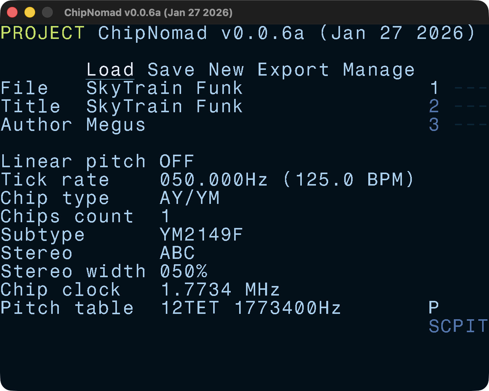
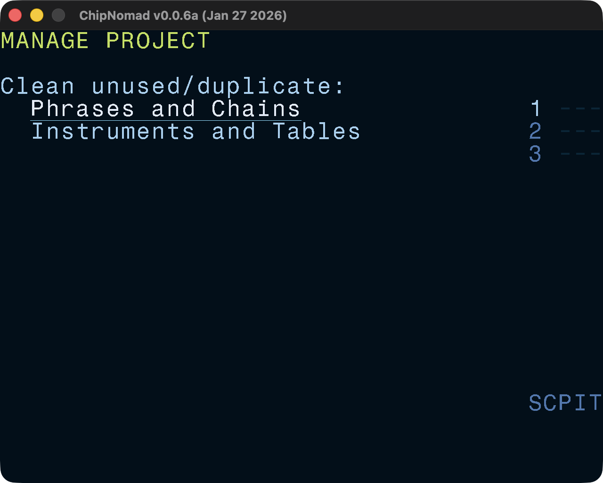
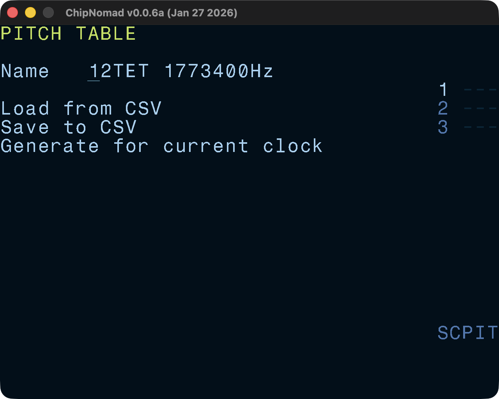
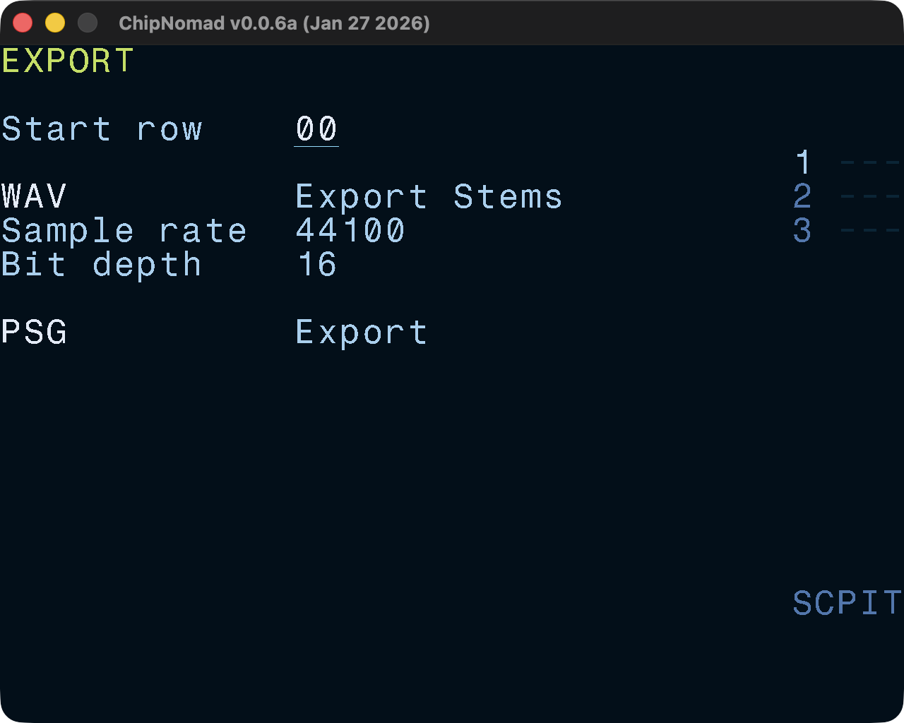

# Project Screen



Configure global project settings:

- Filename, song title, song author
- Linear pitch on/off
- Tick rate (up to 200Hz)
- Chip type (AY/YM chips currently)

AY-specific settings:

- Chips count (1-3)
- Chip subtype: AY-3-8910 or YM2149F
- Stereo layout (ABC, ACB, BAC)
- Stereo width
- Chip clock (select from several most common values)
- Pitch table operations: load, save, generate

## Manage

Additonal screen with helpful project management options. Press **OPT** to leave the screen.

## Pitch Table

Load/save pitch tables and generate a standard 12TET table (A4 = 440Hz) for the selected chip clock.

## Export

Export to WAV as a mix, or create stems (each track is a separate WAV file).

Export to PSG format to use with players native to retro platforms that use AY/YM chips (ZX Spectrum, Atari ST, Amstrad CPC, etc).