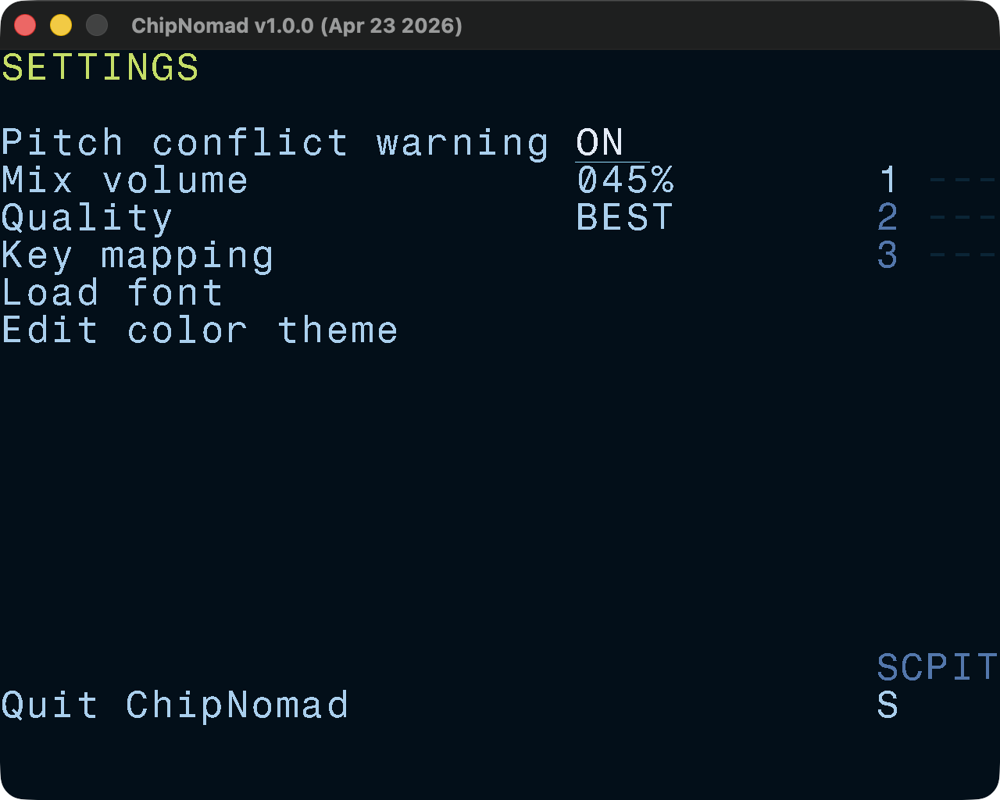
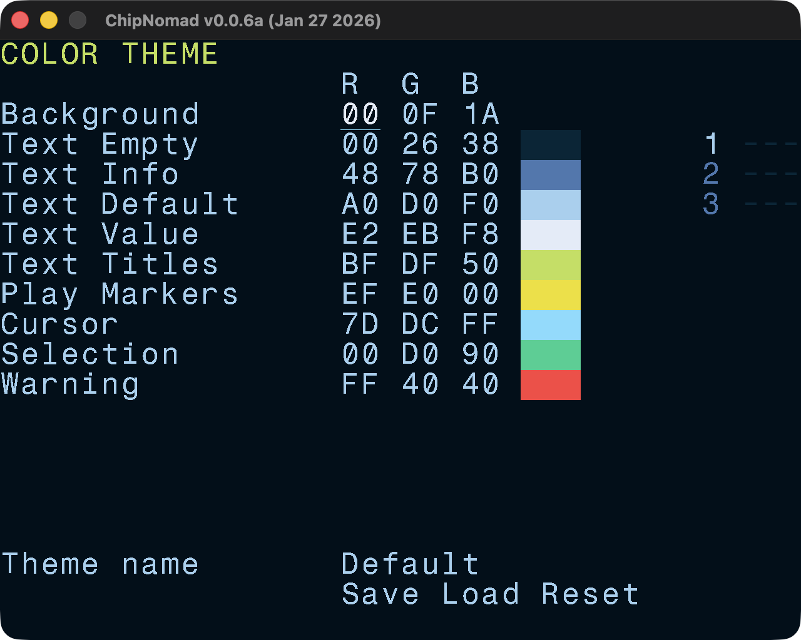
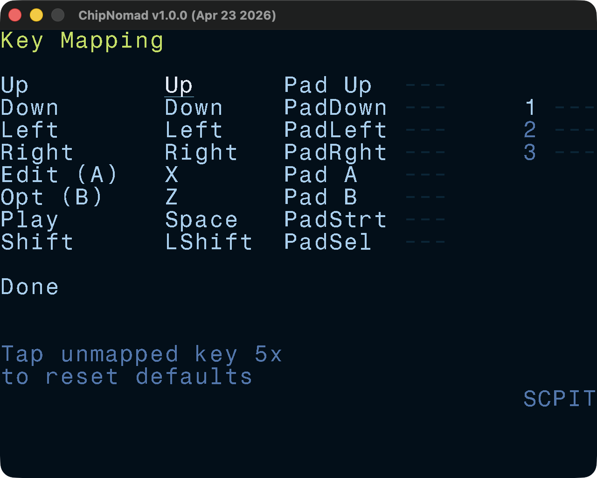

# Settings Screen

Setting screen has a few useful settings:

- **Pitch conflict warning**. Because the tone phase is unpredictable on AY, playing sounds with the same pitch on different tracks can create unpleasant phasing effects. When this option is enabled, such conflicts will be highlighted during playback to help with detecting and fixing them.
- **Mix volume**. This is master mix volume and you may need to lower it if you use multiple chips. 60% works well for 1 AY chip and 40% is good for 2 AY chips. When audio overload happens, it will be highlighted in the playback preview area.
- **Quality**. Changes the resampling filter quality for Ayumi AY emulation engine. Most platforms should be fine with the BEST, but pre-2024 RG35xx may need lower setting.
- **Gamepad swap A/B**. Swap A and B keys on a controller, mostly useful for desktop builds.
- **Key mapping**. Opens [key mapping screen](#key-mapping).
- **Edit color theme**. Opens [color theme screen](#color-theme).

## Color Theme

Edit, load, and save color themes. Make ChipNomad truly yours!

## Key Mapping

Redefine standard keys and map up to 3 physical keys to each logical key. ChipNomad falls back to default key mapping if a key doesn't have any mapping at this screen.