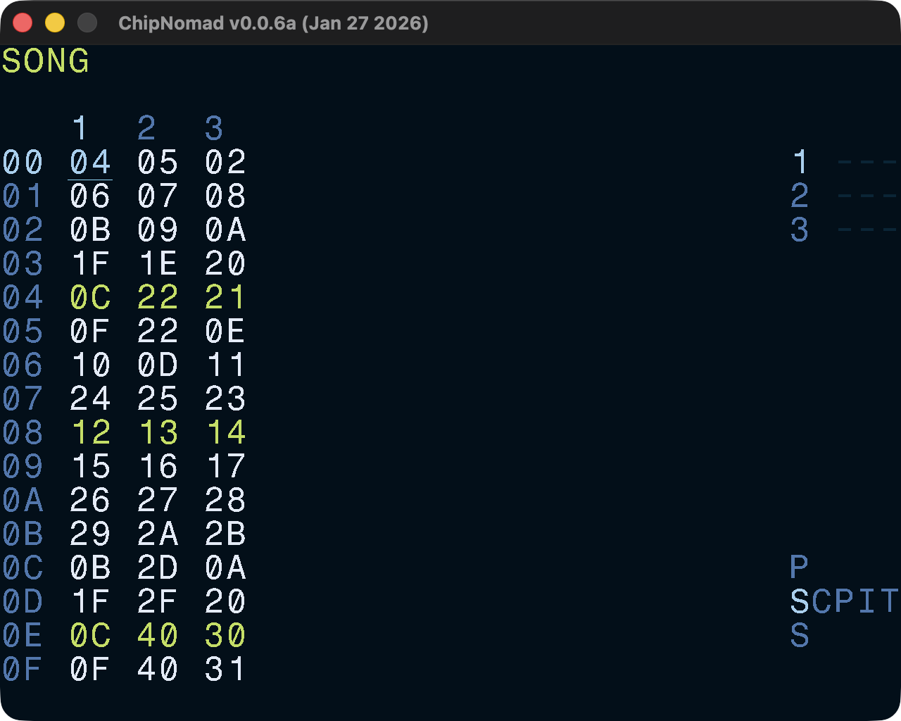

# Song Screen

Arrange chains into a complete song. Tracks are arranged left to right and sequence of chains is arranged vertically. Each track is fully independent and since chains can have from 1 to 16 phrases tracks can go out of sync with each other. To avoid that, design your chains to stay in sync. It is common to allocate one chain for empty phrases, usually 00 or FE.

You can have multiple sub-songs in a project by creating "islands" — sections separated by empty rows.

## Controls

In addition to the [common controls](/manual/#common-controls) the following controls are available:

- **OPT** + \[**UP** or **DOWN**\]: jump 16 positions up/down
- Select range, then **SHIFT** + **EDIT**: clone chains
- Select range, then **SHIFT** + Double-tap **EDIT**: deep clone chains — clone both chains and phrases in chains
- Select range, then **EDIT** + \[**UP** or **DOWN**\]: move selection up or down
- Triple-tap **OPT**: "bookmark" a chain
- **OPT** + **SHIFT**: Mute current track (release **OPT** first to hold the mute)
- **OPT** + **PLAY**: Solo current track (release **OPT** first to hold the mute)
- **OPT** + \[**LEFT** or **RIGHT**\]: solo all tracks to the left or to the right of the current track
