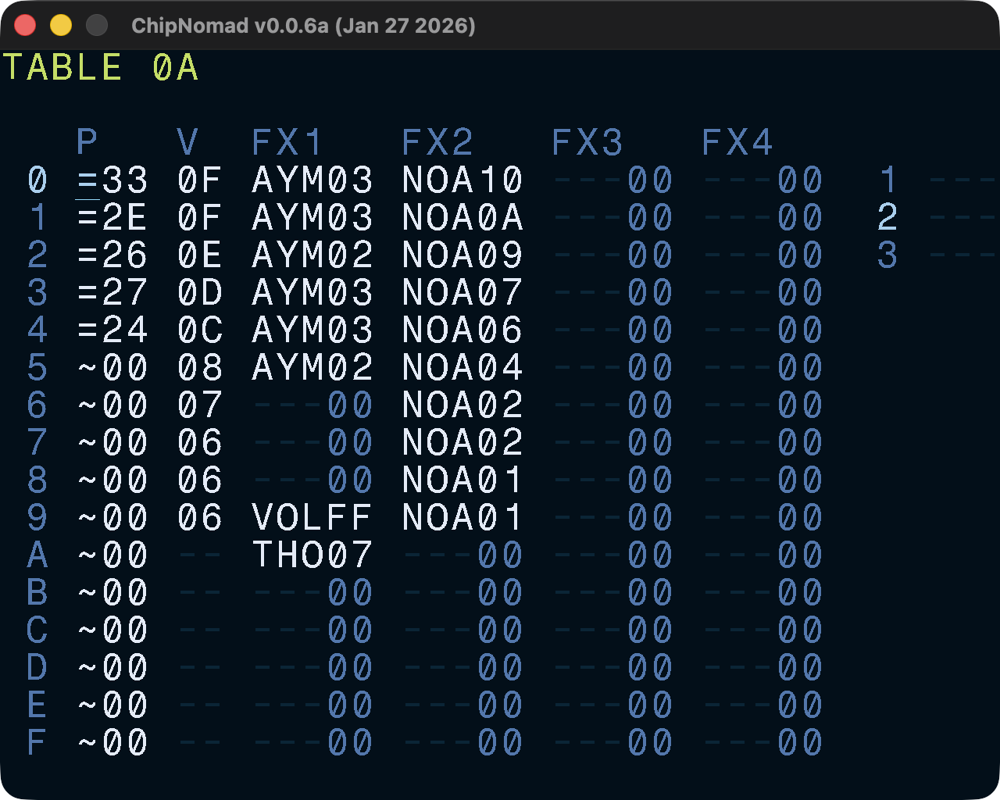

# Table Screen

Tables are the main sound design tool in ChipNomad. If you're familiar with Vortex Tracker, tables are
the mix of instruments and ornaments and can do even more. If you're familiar with LSDJ and M8, you know
what tables are.

Pitch column can have relative (**~**) or absolute (**=**) pitch values in semitones. Volume is applied on top of ADSR
envelope. Four FX lanes are generally equal to FX lanes in phrase, however, there are minor differences
in the behavior of some FX in phrases and tables.

Putting `TIC` FX on the last table row will set the speed for this column, overriding the default table speed from the instrument.

Tables 00-7F are reserved for default instrument tables, tables 80-FE can be used as aux tables (TBX effect).

## Controls

In addition to the [common controls](/manual/#common-controls) the following controls are available:

- **EDIT** + \[**UP** or **DOWN**\] on an FX name column: open FX select screen
- **OPT** + **DIRECTION**: navigate between tables
